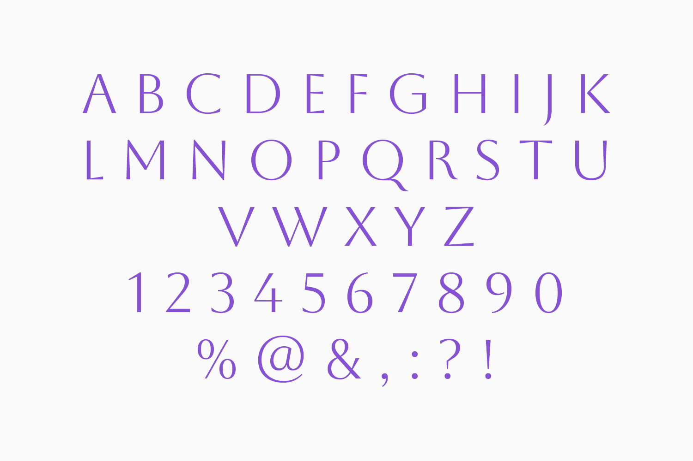

# Aboreto

Aboreto is a display typeface based on early renaissance majuscule alphabet done by Luca della Robbia, a 15th century Florentine sculptor. The typeface is not a straightforward digitalization (it even couldn’t be as the early Latin alphabet didn’t include all the letters we use today) but more of a revival which keeps current needs and technologies in mind.

Aboreto has vertical stress, a feature more typical of later-century typefaces. Another uniqueness lies in the construction, because it is essentially a sans-serif typeface that has only occasional indication of serifs – either via the “hidden” serifs caused by stroke tapering or by slightly thickening the stroke endings.

Aboreto comes in one weight – a high contrast regular that is on the thinner side.

## OpenType features

**Following OpenType features are available:**

- Localized Forms / locl
- Fractions / frac
- Numerators / numr
- Denominators / dnom
- Superscript / sups
- Subscript / subs
- Scientific Inferiors / sinf
- Proportional Figures / pnum
- Tabular Figures / tnum
- Ordinals / ordn
- Contextual Alternates / calt

## License

This Font Software is licensed under the SIL Open Font License, Version 1.1. This license is available with a FAQ at https://scripts.sil.org/OFL
